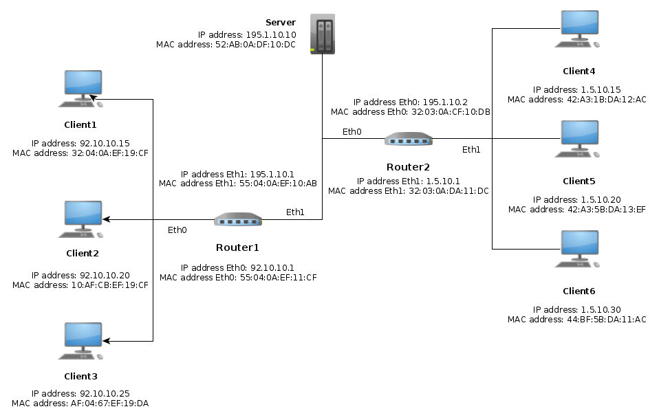

# A simple network simulation

Progetto realizzato per l'esame di *Programmazione di Reti*.

L'obiettivo è quello di simulare un'architettura Server-Router-Client come mostrato nella seguente immagine:

## Features

### Feature richieste

- Il server deve tenere traccia dei client che entrano e che escono dalla rete.

- Quando un client (attivo in rete) vuole inviare un messaggio ad un altro client, dovrà inviare il messaggio al server il quale consegnerà il messaggio al destinatario solo se il client destinatario è attivo, in alternativa restituirà un messaggio al mittente indicando che il client destinatario non è online.

- Gli headers IP ed Ethernet dovranno essere considerati nella versione semplificata ossia composti dai soli indirizzamenti IP e Mac Address

### Feature aggiuntive

- Le specifiche riguardanti le entità che formano il network sono memorizzate in un file di configurazione apposito.

Sono disponibili due versioni del network, "network_basic" è stato impiegato per i test iniziali mentre "network" rappresenta l'architettura richiesta dalla traccia.

In generale a ciascun router può essere legato un numero arbitrario di client.

- Le arp table dei router non contengono infomazioni relative ai client. Sono state perciò implementati i meccanismi di ARP request e ARP reply per permettere ai router di ricavare informazioni sull'indirizzo mac associato a ciascun client.

## Avviare la simulazione

Per prima cosa si controlli se i requisiti sono rispettati.

Per lanciare la simulazione bisogna eseguire lo script principale `cli.py` 

In ambiente Unix, dopo aver lanciato il comando `chmod`, basta lanciare sul terminale:

`sudo ./cli.py`

Su Windows si può lanciare impiegando Idle ad esempio.

## Fermare la simulazione

Basta premere la combinazione di tasti `CTRL+C`, o alternativamente selezionare il comando `Quit` sul terminale.

In entrambi i casi sarà lanciata una procedura di pulizia che chiederà a tutti i thread attivi di terminare, con la garanzia che termineranno in breve tempo, e di chiudere le tutte le connessioni aperte.

Talvolta questa procedura potrebbe richiedere qualche secondo.

## Requisiti

Il programma è stato sviluppato con il seguente interprete Python:
Python interpreter 3.8.2 64-bit

L'unica libreria aggiuntiva richiesta è PyYAML per la lettura del file di configurazione,
può essere installata con il seguente comando:

`pip install pyyaml`